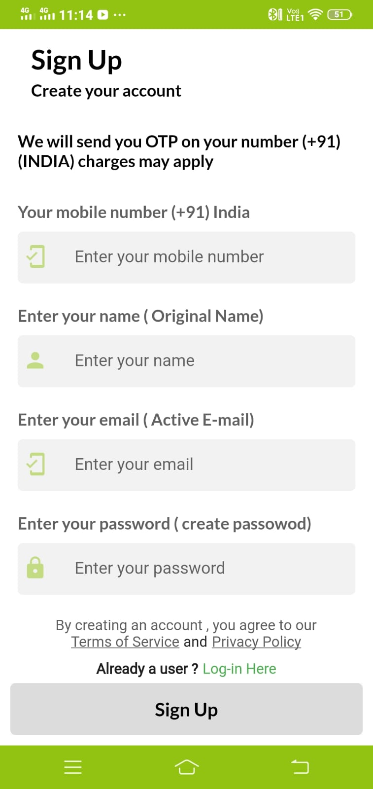
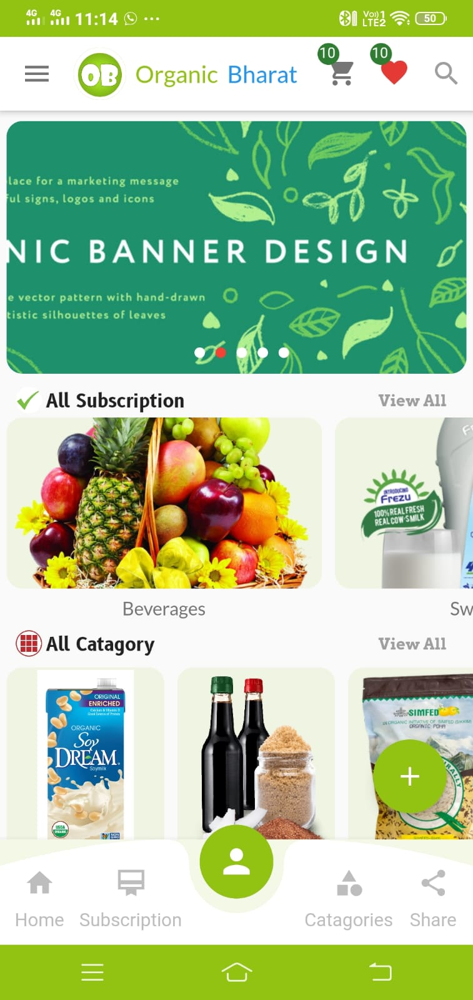
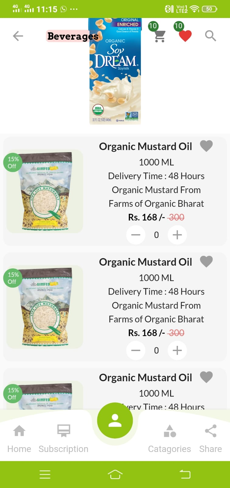
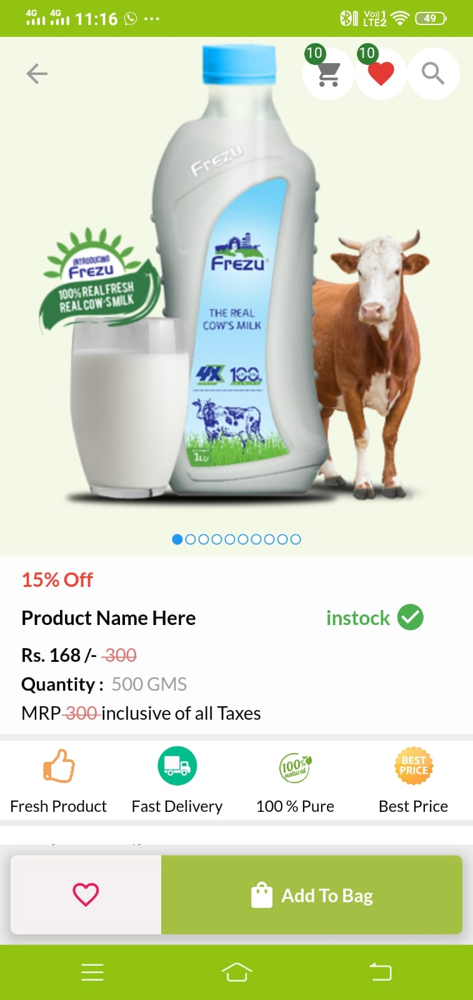
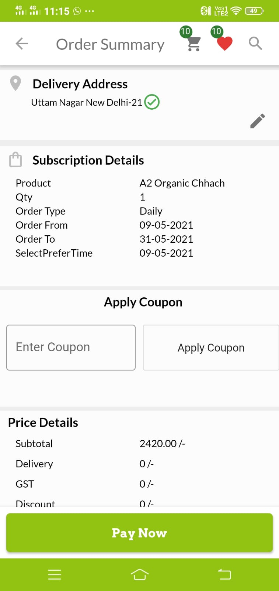
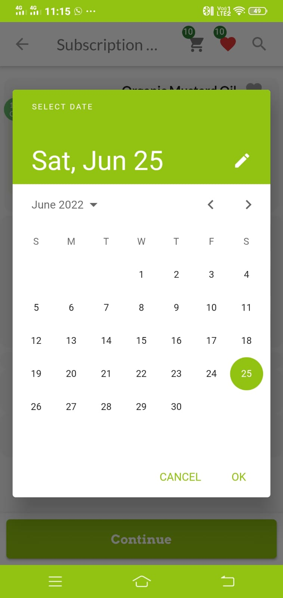
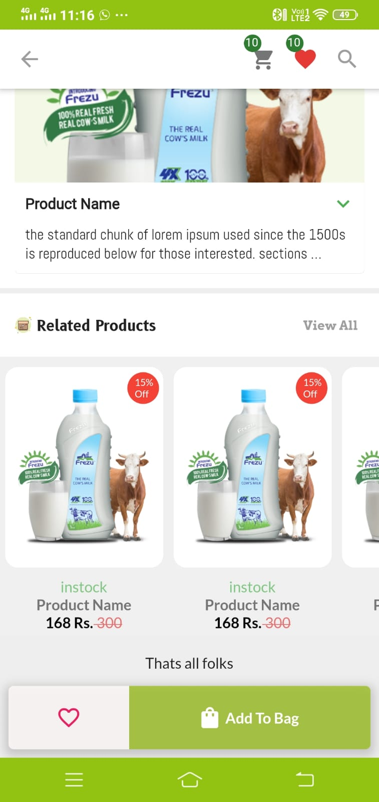

# **Google Flutter with Getx Ui App by `Inderkant`**
# ** Please Help Someone by Food and Cloths **
# **Download the source code and try to learn something from this code Happy Coding _-_**
# **This will be the Paid Ui and the amount is very affordable **
## Below are the `Screen shot of` ** Project **

# ** `Sign Up Page` **

# ** `Login Page` **

# ** `Otp Page` **

# ** `Home Page` **

# ** `Side Drawer` **

# ** `Product List` **

# ** `Single Product` **

# ** `Order Summary` **

# ** `Date Screen` **

# ** `Grid List` **

# ** `Subscription Screen` **

